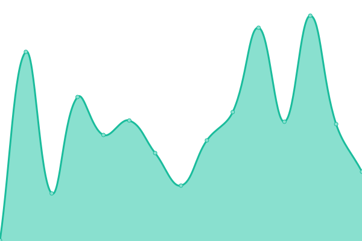
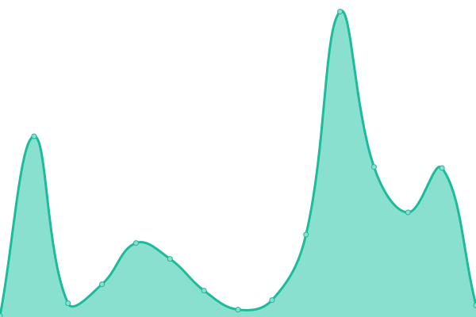
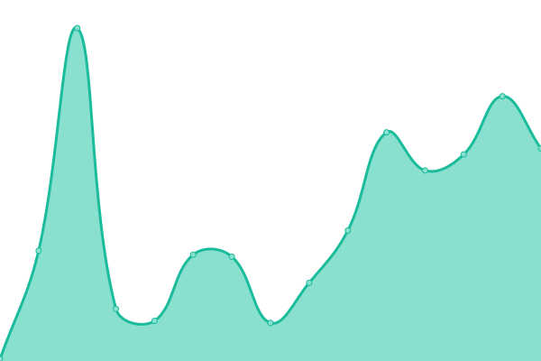

# [📈 Live Status](https://magnatome.github.io/epic-vs-ikon-status-page): <!--live status--> **🟩 All systems operational**

This repository contains the open-source uptime monitor and status page for [Magnatome](https://magnatome.com), powered by [Upptime](https://github.com/upptime/upptime).

With [Upptime](https://upptime.js.org), you can get your own unlimited and free uptime monitor and status page, powered entirely by a GitHub repository. We use [Issues](https://github.com/magnatome/epic-vs-ikon-status-page/issues) as incident reports, [Actions](https://github.com/magnatome/epic-vs-ikon-status-page/actions) as uptime monitors, and [Pages](https://magnatome.github.io/epic-vs-ikon-status-page) for the status page.

<!--start: status pages-->
<!-- This summary is generated by Upptime (https://github.com/upptime/upptime) -->
<!-- Do not edit this manually, your changes will be overwritten -->
<!-- prettier-ignore -->
| URL | Status | History | Response Time | Uptime |
| --- | ------ | ------- | ------------- | ------ |
|  [Epic vs Ikon](https://www.epicorikon.com) | 🟩 Up | [epic-vs-ikon.yml](https://github.com/magnatome/epic-vs-ikon-status-page/commits/HEAD/history/epic-vs-ikon.yml) | 

 151ms
     
 | 

<a href="https://status.epicorikon.com/history/epic-vs-ikon">100.00%</a>
    

|  [Resort Map](https://www.epicorikon.com/map) | 🟩 Up | [resort-map.yml](https://github.com/magnatome/epic-vs-ikon-status-page/commits/HEAD/history/resort-map.yml) | 

 36ms
     
 | 

<a href="https://status.epicorikon.com/history/resort-map">100.00%</a>
    

|  [Compare Passes](https://www.epicorikon.com/passes/compare) | 🟩 Up | [compare-passes.yml](https://github.com/magnatome/epic-vs-ikon-status-page/commits/HEAD/history/compare-passes.yml) | 

 53ms
     
 | 

<a href="https://status.epicorikon.com/history/compare-passes">100.00%</a>
    

<!--end: status pages-->

[**Visit our status website →**](https://magnatome.github.io/epic-vs-ikon-status-page)

## 📄 License

- Powered by: [Upptime](https://github.com/upptime/upptime)
- Code: [MIT](./LICENSE) © [Anand Chowdhary](https://anandchowdhary.com), supported by [Pabio](https://pabio.com)
- Data in the `./history` directory: [Open Database License](https://opendatacommons.org/licenses/odbl/1-0/)
